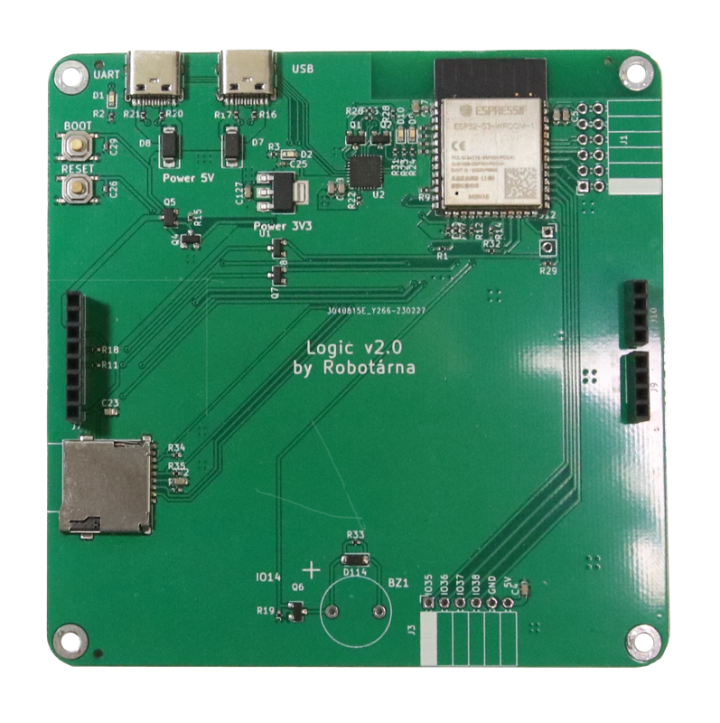
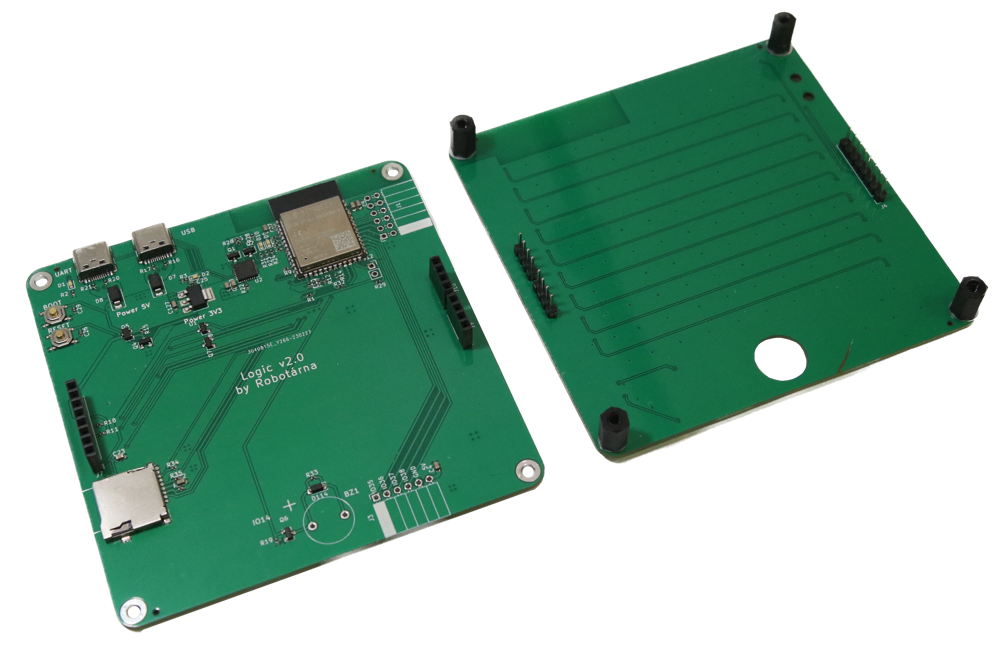

# Logic

Logic je univerzální programovatelná hračka určená pro výuku programování, kterou vyvinula [Robotárna](https://helceletka.cz/robotarna).

Logic připomíná herní konzoli. Je vybavený 105 RGB LED diodami, které mohou sloužit jako displej, má mnoho tlačítek a bzučák. Vnitřní část pohání mikrořadič ESP32.

Děti (no, nejen ony) mohou vytvářet vlastní hry a učit se přitom programovat. Je dokonce možné spouštět multiplayerové hry, protože vestavěný procesor podporuje jak WiFi, tak Bluetooth 4.

Tento projekt byl připraven pro [Robotický tábor 2021](https://2021.robotickytabor.cz/) – stránka je dostupná, avšak v češtině. Najdete tam více projektů. Můžete se také podívat na náš [GitHub](https://github.com/RoboticsBrno), kde se dozvíte více o našich dalších projektech.

## Verze HW

Existuje několik verzí HW, přičemž druhá verze představuje zásadní přepracování.

### Seznam změn:

#### v2.0

- nový čip ESP32 S3 (namísto "normálního" ESP32)
- slot pro [SD kartu](code/sdcard.md)
- konektor [PMOD](code/pmod.md) (standardizované rozhraní pro připojení různých periferií)
- přepracované uspořádání tlačítek s dvěma směrovými kříži
- piezo místo pouhého bzučáku (takže můžete přehrávat různé tóny)
- jasnější inteligentní LED

=== "Logic v2"
	
	
	

=== "Logic v1"
	
	
