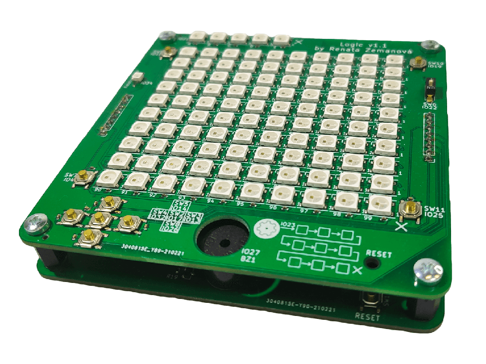

# O co jde?

Logic je univerzální programovatelná deska určená pro výuku základů programování.
Tvar desky je navržen tak, aby se na něm dala jednoduše hrát oblíbená hra Logik.
Dále se na desce dá také hrát například TicTacToe, Simon, nebo velmi známá hra Had.

Deska obsahuje 105 inteligentních LED a 9 uživatelsky programovatelných tlačítek.
Pro zvukovou signalizaci je na Logicu také piezo.

Mozkem Logicu je moderní mikrokontrolér ESP32.

