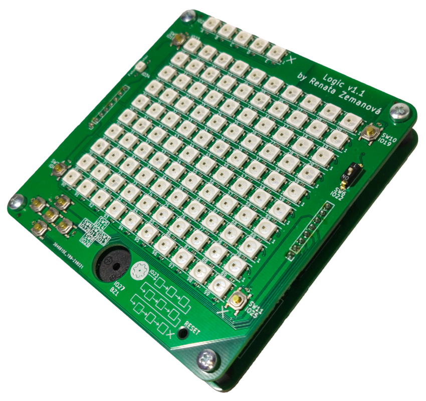

# About Logic

Logic is a universal programmable toy designed for teaching programming
developed at [Robotárna](https://helceletka.cz/robotarna).

Logic resembles a game console. It has 105 RGB LEDs that can serve as a display, it
has numerous buttons and a buzzer. Under the hood, it is powered by the ESP32
microcontroller.

Kids (well, not only them) can create custom games and
learn programming while doing so. It is even possible to run multiplayer games as the on-board
processor features both, WiFi and Bluetooth 4.

This project was prepared for [Robotic Camp 2021](https://2021.robotickytabor.cz/) ­–
the page is available, however, in Czech. You will find more project there. You
can also see our [GitHub](https://github.com/RoboticsBrno) for find out more
about our other projects.

## HW revisions

There are multiple HW revisions out in the wild, with the v2 being a major overhaul.

### Changelog:

#### v2.0

- new ESP32 S3 chip (instead of "normal" ESP32)
- [SD Card slot](code/sdcard.md)
- [PMOD connector](code/pmod.md) (a standardized interface to connect various peripherials)
- revised button layout with two direction crosses
- piezo instead of just a buzzer (so you can play different tones)
- brighther smart LEDs

=== "Logic v2"
	
	
	

=== "Logic v1"
	
	
