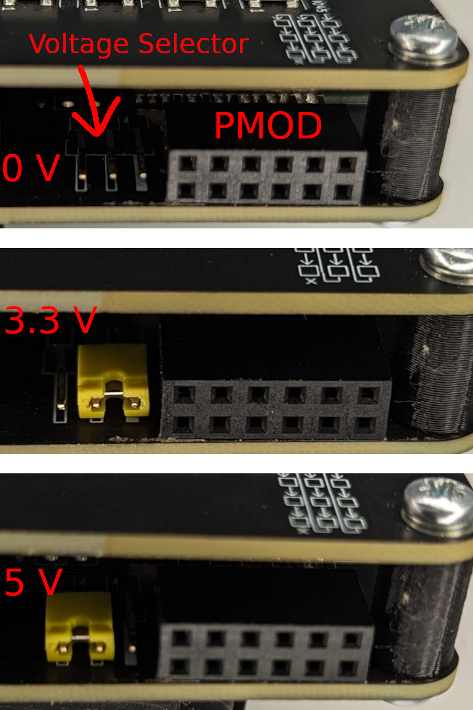

# PMOD connector

The Logic v2 and newer has a PMOD connector, which is a standardized way to connect various peripherials.

!!! info

    The 1.x HW revisions do not have PMOD connector.

## Pinout

Pinout is visible from the underside of the board as white labels.

!!! warning

    The 5V label is wrong, and it should say `VCC` instead - the voltage is configurable, see below.

## Voltage setting

On the v2.0 HW revision, there are three pinheades to be used to set the voltage on PMOD VCC.
They are unfortunatelly without labels, so here are photos of the 3.3 V and 5 V settings:

