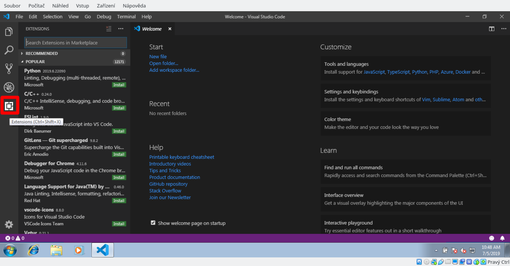

# Software Development Kit

## Stručná verze pro zkušené vývojáře

Logic je řízený mikrokontrolérem ESP32. Doporučujeme použít
[nástroj PlatformIO](https://platformio.org/) jako vývojové prostředí, protože
umí automaticky nainstalovat potřebný toolchain a další závislosti. Navíc se
snadno integruje do mnoha existujících textových editorů a IDE.

Poskytujeme [knihovnu ovladačů](https://github.com/RoboticsBrno/Logic_library)
pro desku. Můžete ji ve svých projektech v PlatformIO použít tak, že do souboru
`platformio.ini` přidáte tento řádek:

```
lib_deps = https://github.com/RoboticsBrno/Logic_library
```

Knihovna nabízí [několik příkladů](https://github.com/RoboticsBrno/Logic_library/tree/main/examples),
[projektovou šablonu](https://github.com/RoboticsBrno/Logic_library/tree/main/examples/_TEMPLATE)
a [dokumentaci](https://roboticsbrno.github.io/Logic_library/). Také je k dispozici
[rychlý přehled všech funkcionalit](code/utils.md).

## Krok za krokem

Pokud jste začátečníci, možná vám přijde vhod následující podrobný návod. Je primárně
zaměřený na uživatele Windows (jak víte, vše týkající se vývoje je na tomto
systému obvykle složitější). Budete potřebovat nainstalovat:

1. Editor [Visual Studio Code](https://code.visualstudio.com/Download)
1. Python
    1. Pro Windows 8 a vyšší musíte stáhnout Python z [Windows Store](https://www.microsoft.com/en-us/p/python-39/9p7qfqmjrfp7)
    1. Pro Windows 7 potřebujete [Python 3.8.10](https://www.python.org/ftp/python/3.8.10/python-3.8.10-amd64.exe)
2. [Git pro správu verzí](https://git-scm.com/download/win)
3. USB ovladače ([Windows 7](https://www.silabs.com/documents/public/software/CP210x_Windows_Drivers.zip),
[Windows 8 a vyšší](https://www.silabs.com/documents/public/software/CP210x_Universal_Windows_Driver.zip))
4. Plugin PlatformIO pro Visual Studio Code

## 1. Visual Studio Code
Toto je editor, ve kterém budete upravovat své programy. [Stáhněte jej odtud](https://code.visualstudio.com/Download) a nainstalujte.

## 2. Python

Počítač musí mít nainstalovaný Python.

#### Windows 8, Windows 10

Je **nezbytné**, abyste Python nainstalovali přes Windows Store, jinak
PlatformIO nebude fungovat správně. Můžete použít [přímý odkaz do Windows
Store](https://www.microsoft.com/en-us/p/python-39/9p7qfqmjrfp7).

#### Windows 7

[Stáhněte Python
3.8](https://www.python.org/ftp/python/3.8.10/python-3.8.10-amd64.exe) (novější
verze Pythonu na Windows 7 nefungují) a nainstalujte jej. Během instalace
se ujistěte, že je zaškrtnuto "Add to PATH".

## 3. Git

[Stáhněte Git](https://git-scm.com/download/win) a nainstalujte ho. Všechny
možnosti můžete ponechat na výchozích hodnotách.

## 4. Ovladače pro Logic

Stáhněte ovladače:

* [Windows 8, Windows 10](https://www.silabs.com/documents/public/software/CP210x_Universal_Windows_Driver.zip)
* [Windows 7](https://www.silabs.com/documents/public/software/CP210x_Windows_Drivers.zip)

Je třeba rozbalit celý archiv a spustit soubor `CP210xVCPInstaller_x64.exe`. Poté
se řídit zobrazeným průvodcem.

## 5. Platform.io IDE Extension
Otevřete Visual Studio Code a nainstalujte rozšíření PlatformIO:

<br>
1. Otevřete VSCode a vlevo klikněte na tlačítko Extensions.
<hr>

<br>
2. Nainstalujte rozšíření PlatformIO IDE.
<hr>

<br>
3. Počkejte, než se nainstalují všechny balíčky.
<hr>

<br>
4. Následně vyčkejte na instalaci PlatformIO Core. Může to chvíli trvat.
<hr>

<br>
5. Jakmile je vše dokončeno, restartujte editor.
<hr>

## 6. Hotovo!

Nyní byste měli být připraveni začít vyvíjet vlastní hry pro Logic! Můžete začít
[příkladovými projekty](https://github.com/RoboticsBrno/Logic_library/tree/main/examples).
Otevřete je pomocí `File` -> `Open Folder`.

<br>
Po otevření příkladu je potřeba nastavit verzi Logic. Klikněte na `Defaul <PROJECT>` a vyberte svou verzi Logic.

<br>
Poté můžete příklad zkompilovat a nahrát do svého Logic. K tomu použijte tlačítka v levém dolním rohu.
