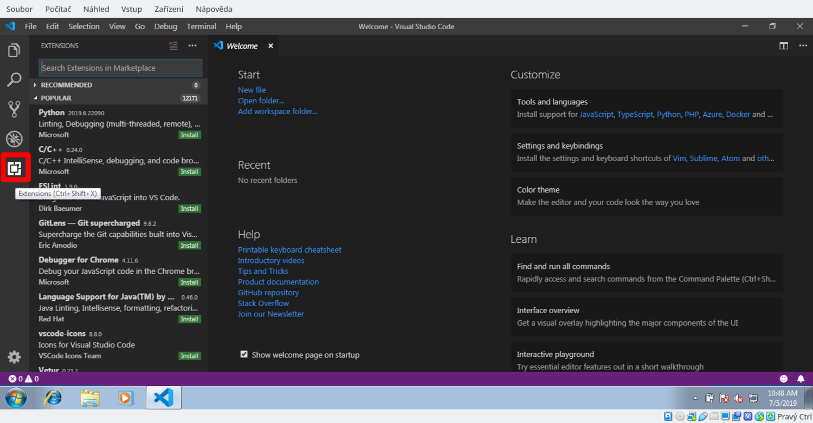
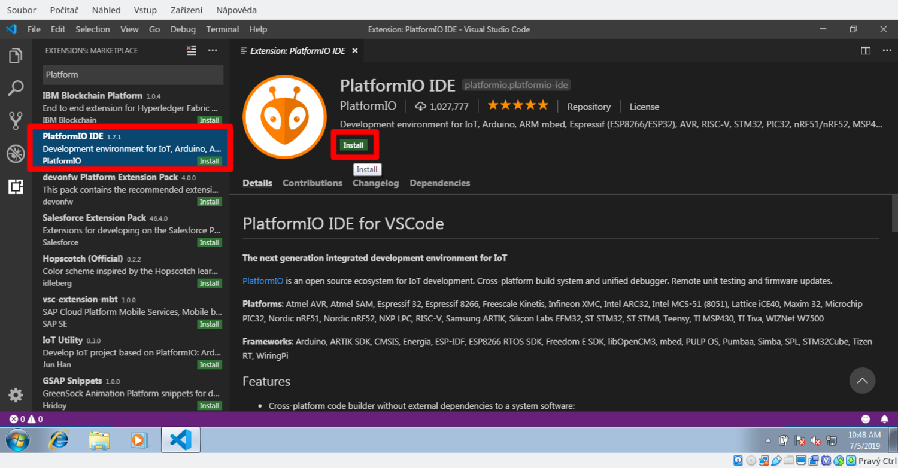
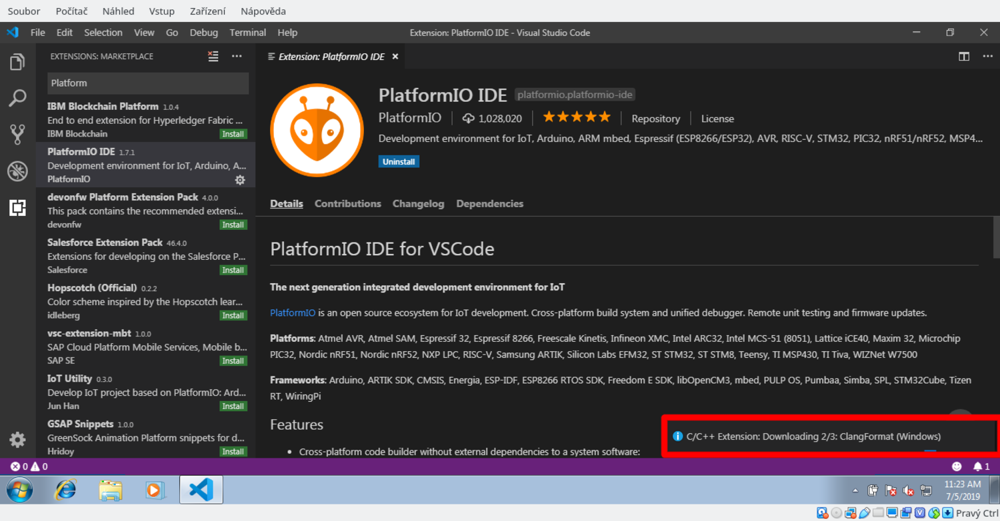
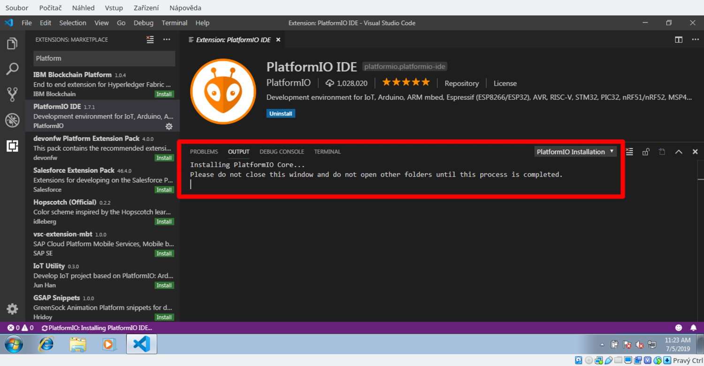
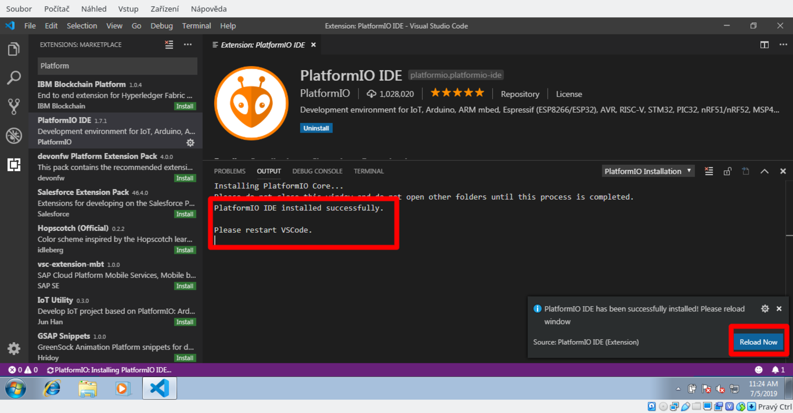

# Instalace IDE

Pro vývoj programů pro desku Logik potřebujete nainstalovat několik součástí:

1. Editor [Visual Studio Code](https://code.visualstudio.com/Download)
1. Python
    1. Na Windows 8 a vyšší je třeba Python 3.9 nebo vyšší z [Windows Store](https://www.microsoft.com/en-us/p/python-39/9p7qfqmjrfp7)
    1. Na Windows 7 je třeba [Python 3.8.10](https://www.python.org/ftp/python/3.8.10/python-3.8.10-amd64.exe)
2. Správce verzí [Git](https://git-scm.com/download/win)
3. Ovladače pro přípojení Logika do počítače přes USB ([Windows 7](https://www.silabs.com/documents/public/software/CP210x_Windows_Drivers.zip), [Windows 8 a vyšší](https://www.silabs.com/documents/public/software/CP210x_Universal_Windows_Driver.zip))
4. Rozšíření platform.io do Visual Studio Code

**Postupujte na této stránce odshora dolů a následujte instrukce.**

## 1. Visual Studio Code
Editor, ve kterém budeme tvořit programy. [Stáhněte ho z oficiálního webu](https://code.visualstudio.com/Download) a nainstalujte.

## 2. Python
Na počítači musí být instalovaná podpora pro programovací jazyk Python.

#### Windows 8, Windows 10
Na novějších Windows je **nutné nainstalovat Python přes Windows Store**, jiné cesty nefungují. Otevřete aplikaci Windows Store (třeba přes start menu),
v ní najděte pomocí hledání Python 3.9 a získejte/nainstalujte ho. Můžete také zkusit [přímý odkaz](https://www.microsoft.com/en-us/p/python-39/9p7qfqmjrfp7)

#### Windows 7
[Stáhněte Python 3.8](https://www.python.org/ftp/python/3.8.10/python-3.8.10-amd64.exe) (novější na Windows 7 nefunguje) a nainstalujte ho.
Ujistěte se, že možnost "Add to PATH" je při instalaci zatržena.

## 3. Git
[Stáhněte si Git](https://git-scm.com/download/win) a nainstalujte ho. Všechno v instalátoru můžete nechat na výchozích hodnotách a pouze klikat "next".

## 4. Ovladače pro Logic
Stáhněte si ovladače:

* [Windows 8, Windows 10](https://www.silabs.com/documents/public/software/CP210x_Universal_Windows_Driver.zip)
* [Windows 7](https://www.silabs.com/documents/public/software/CP210x_Windows_Drivers.zip)

Po stažení je třeba ZIP extrahovat (pravý klik na soubor -> _Extrahovat vše_), a spustit soubor `CP210xVCPInstaller_x64.exe` který se nachází uvnitř.

## 5. Rozšíření Platform.io IDE
Otevřeme Visual Studio Code a nainstalujeme platform.io rozšíření:

 
1. Otevřete VSCode a klikněte na čtveratou ikonku rozšíření na levé straně.

 
2. Najděte a nainstalujte rozšíření PlatformIO IDE.

 
3. Po nainstalování rozšíření se začne stahovat spousta doplňkových balíčků. Počkejte, dokud se nenainstalují C/C++ Extensions…

 
4. … a také PlatformIO Core. Na pomalejším internetovém připojením to bude chvíli trvat.

 
5. Jakmile je vše hotovo, VSCode vám nabídne restart. Přijměte ho.

## 6. Hotovo
Teď by jste měli mít připraveno prostředí pro programování Logika. Můžete třeba zkusit stáhnout [příkladové projekty](/logic/examples/),
pomocí _File_ -> _Open Folder_ některý z nich otevřit a nahrát do Logika pomocí malé ikonky šipky na dolním modrém baru.
